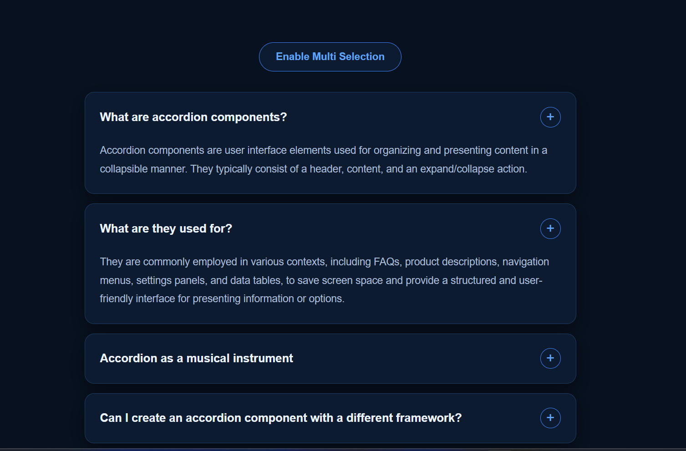
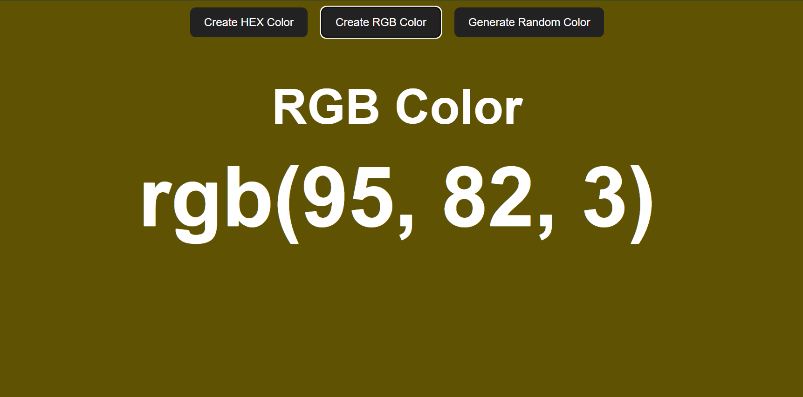
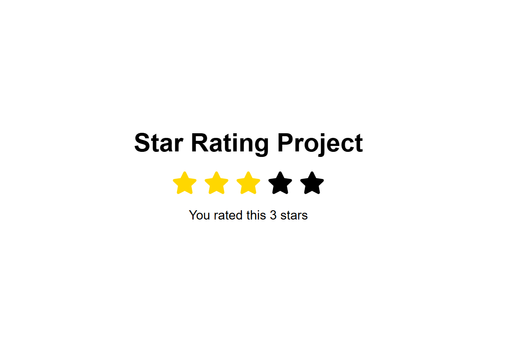
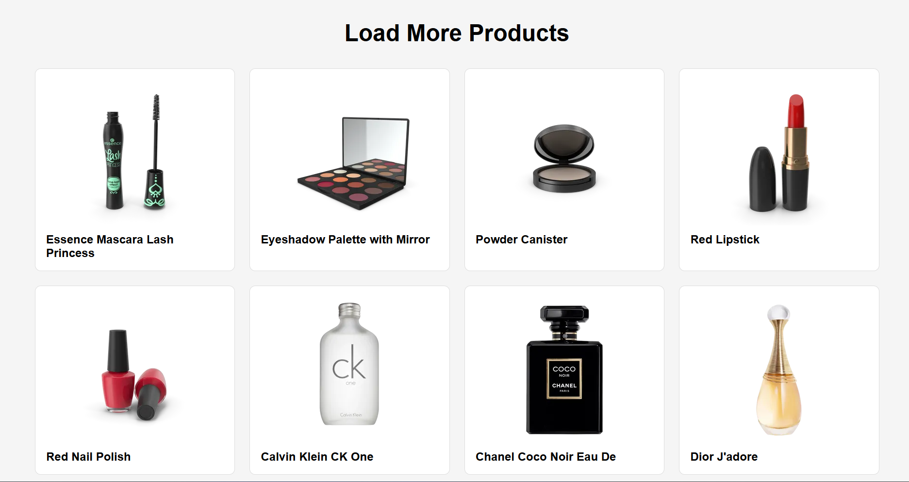
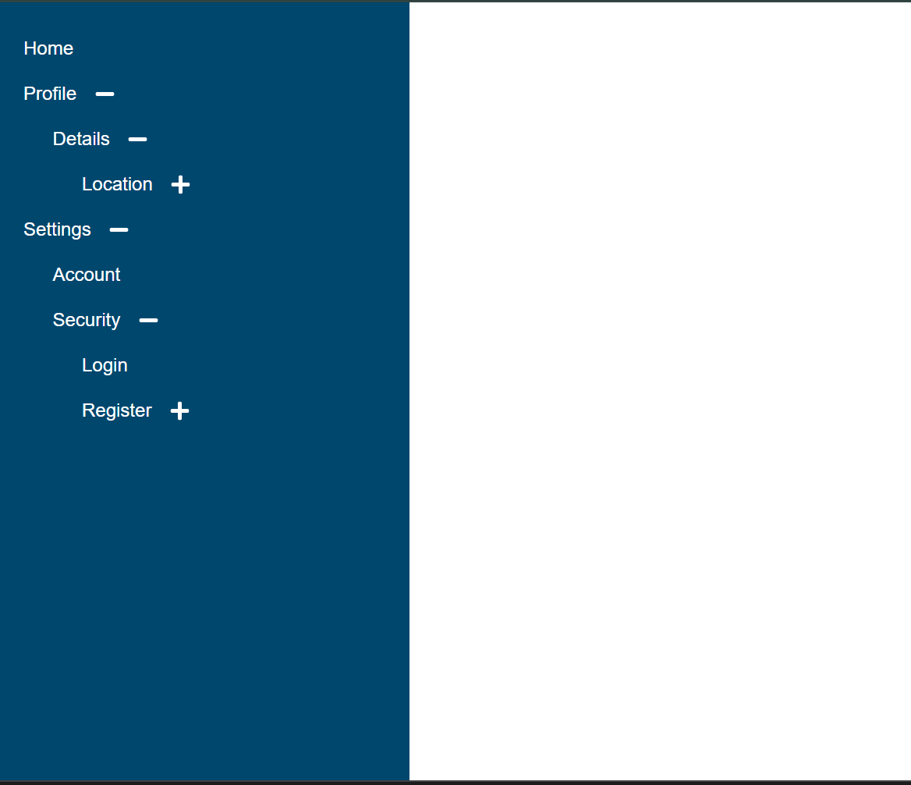
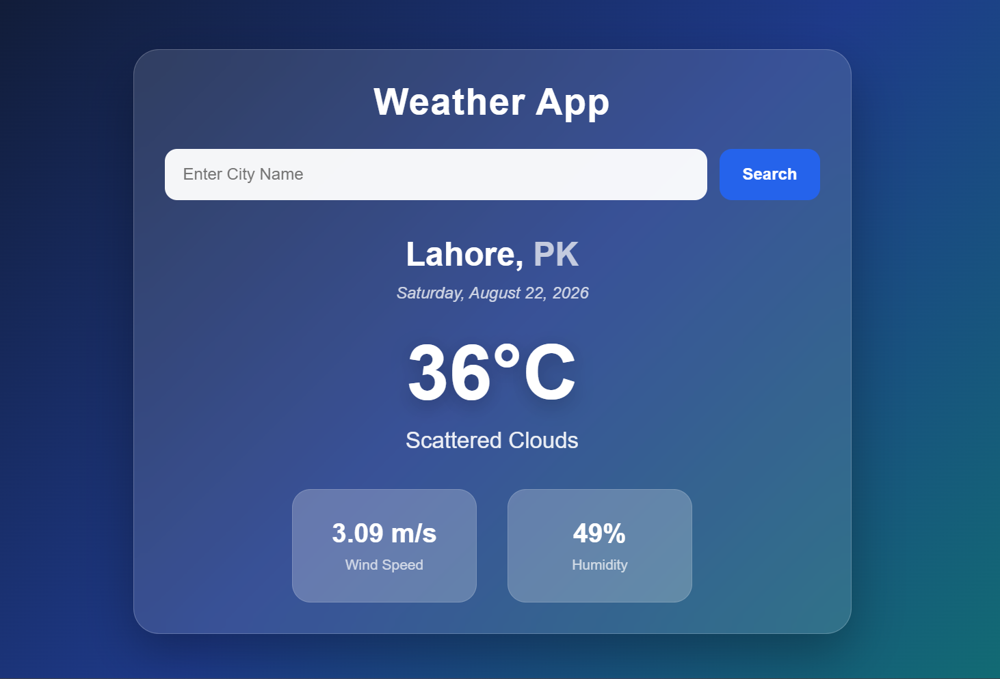
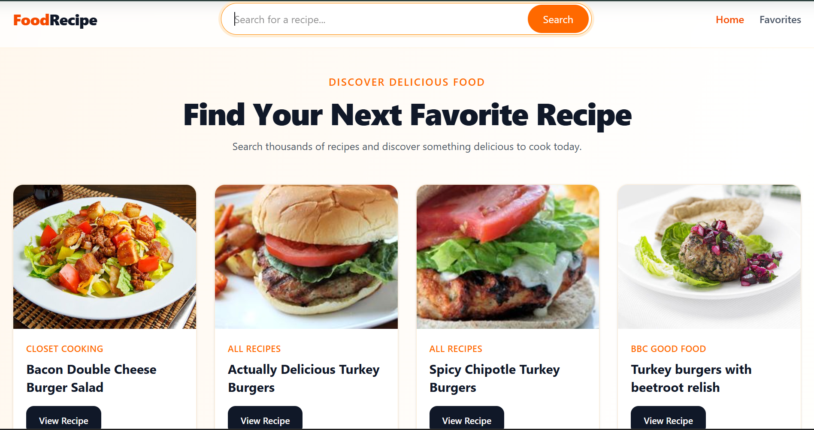

# ⚛️ React Projects

A collection of React.js projects built while learning and practicing modern frontend development.

This repository contains **8 React projects**, each focusing on different concepts such as React Hooks, state management, API integration, reusable components, Context API, and more.

---

## 🚀 Projects

| #  | Project                    | Description                                    |
| -- | -------------------------- | ---------------------------------------------- |
| 01 | **Accordion Project**      | Interactive accordion using React state        |
| 02 | **Random Color Project**   | Dynamic color generator                        |
| 03 | **Star Rating Project**    | Interactive star rating component              |
| 04 | **Image Slider Project**   | Image slider with API integration              |
| 05 | **Load More Data Project** | API data loading with pagination               |
| 06 | **Tree View Project**      | Recursive nested menu                          |
| 07 | **Weather App**            | Weather information using an API               |
| 08 | **Food Recipe App**        | Recipe search application with API integration |

---

## 🖼️ Project Screenshots

### 01. Accordion Project



### 02. Random Color Project



### 03. Star Rating Project



### 04. Image Slider Project


### 05. Load More Data Project



### 06. Tree View Project



### 07. Weather App



### 08. Food Recipe App



---

## 🛠️ Technologies

* React.js
* JavaScript (ES6+)
* Vite
* HTML5
* CSS3
* React Hooks
* React Router DOM
* React Icons
* REST APIs
* Context API

---

## 💻 How to Run the Projects

Each project is a separate React/Vite application.

### 1. Clone the Repository

```bash
git clone https://github.com/HafizIkrashSE/react-projects.git
```

### 2. Open the Repository

```bash
cd react-projects
```

### 3. Choose a Project

For example, to run the Food Recipe App:

```bash
cd 08-FoodRecipeApp
```

You can replace `08-FoodRecipeApp` with any project folder you want to run.

### 4. Install Dependencies

```bash
npm install
```

### 5. Start the Development Server

```bash
npm run dev
```

Vite will display a local URL in the terminal, usually:

```text
http://localhost:5173/
```

Open the URL in your browser to view the project.

---

## 🔄 Running Another Project

First, stop the current development server:

```text
Ctrl + C
```

Then go back to the repository root:

```bash
cd ..
```

Enter another project:

```bash
cd 07-WeatherApp
```

Install its dependencies:

```bash
npm install
```

Run the project:

```bash
npm run dev
```

> **Note:** `node_modules` is intentionally not included in this repository. Each project can install its dependencies using `npm install`.

---

## 📂 Repository Structure

```text
react-projects/
│
├── 01-Accordion-Project/
├── 02-RandomColor-Project/
├── 03-StarRating-Project/
├── 04-ImageSlider-Project/
├── 05-LoadMoreData-Project/
├── 06-TreeView-Project/
├── 07-WeatherApp/
├── 08-FoodRecipeApp/
│
├── screenshots/
│   ├── 01-Accordion-Project.png
│   ├── 02-RandomColor-Project.png
│   ├── 03-StarRating-Project.png
│   ├── 04-ImageSlider-Project.png
│   ├── 05-LoadMoreData-Project.png
│   ├── 06-TreeView-Project.png
│   ├── 07-WeatherApp.png
│   └── 08-FoodRecipeApp.png
│
├── .gitignore
└── README.md
```

---

## 🎯 About This Repository

This repository contains my React.js projects created while learning and practicing modern frontend development.

Each project focuses on different React concepts, including:

* State management
* React Hooks
* API integration
* Conditional rendering
* Reusable components
* Event handling
* Recursive components
* Context API
* React Router
* Dynamic UI updates

I will continue adding more React projects to this repository as I learn and build new applications.

---

## 👨‍💻 Author

**Hafiz Ikrash**

GitHub: [@HafizIkrashSE](https://github.com/HafizIkrashSE)

⭐ More React projects coming soon!
